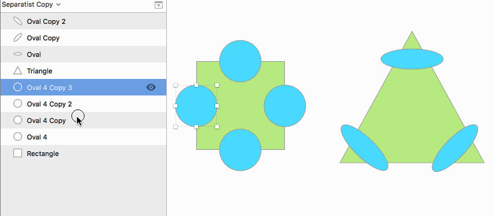
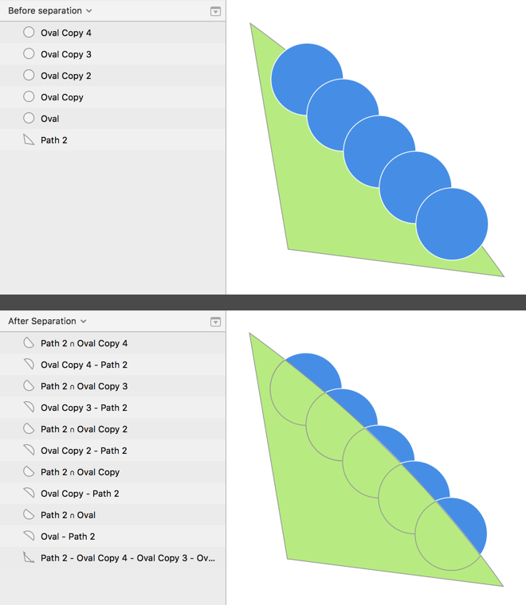

# Separate Shapes

A plugin for ”boolean” separating of overlapping shapes. Similar to _divide_ in Adobe Illustrator's Pathfinder.

## Demo

It can separate several shapes from the base shape, a multi-split, if you like:

## Install

Or if you use [Runner](http://bit.ly/SketchRunnerWebsite), it can install this plugin as well.

Or, do it manually:

1. Download the ”To install” zip file from [the latest release](https://github.com/PEZ/SketchSeparateShapes/releases)
2. Unzip
3. Double-click the `.sketchplugin` package.
## How to use

Select two or more layers and select *Separate Shapes* from the *Plugin* menu.

When more than two shapes are selected the bottommost shape will be considered the _base_ shape and every shape on top of the _base_ will be separated, one at a time towards the base shape. That is, the _non base_ shapes will *not* get seperataded from each other. Inspect the list of layers in the below screenshots, before and after the separation is done, and it might be clear what you can expect the plugin to do.

