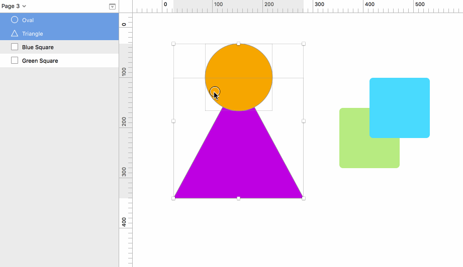

# SeparateShapes

A plugin for ”boolean” separating two overlapping shapes. Like _divide_ in Adobe Illustrator's Pathfinder.

## Install

1. Download the ”To install” zip file from [the latest release](https://github.com/PEZ/SketchSeparateShapes/releases)
2. Unzip
3. Double-click the `.sketchplugin` package.